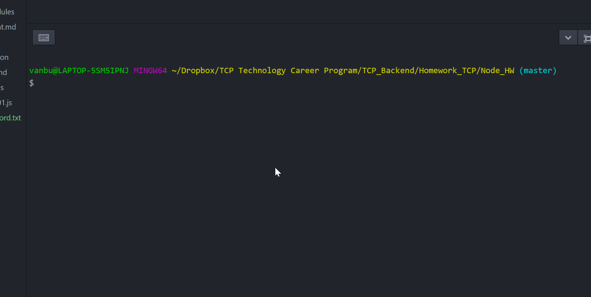

# Serve_Me_Up: An Experiment in Node.js

This application serves to explain the value of creating servers through an interactive demo of node.js

_Note: This application is an assignment of TechBridge's Technology Career Program, June_2020_Cohort_



--------------------------------------------------------------------------------

## User Story

```
As a student I want to create a server that accepts user input
in the command line so that I know how to create a server.
```

### Assignment Acceptance Criteria

**_Given_** that the user is prompted with a question

**_When_** the user enters a password

**_Then_** the password shall store to a text file

- Create a `userInput.js` file
- Create a `greeting.js`file
- Create a `userPassword.txt` file
- The `userInput` file must use `node.js` `fs`
- The `userInput` file shall use `inquirer` npm dependency
- The `userInput` file shall `require` the `greeting` file
- The `userInput` file shall `console.log` your greeting before `userQuestions`
- The `userInput` file must include a `function` called `userQuestions`
- The `function` `userQuestions` should prompt user input
- The `greeting` file must use `module.exports`
- The `greeting` file mush have a `greeting variable` with a `string` value
- Complete a `npm install` `npm inquirer` (undocumented, but fine for now)
- `userPassword.txt` file must have user data store
- Must have comments (pseudo code) explaining your code
- Create a `GitHub` repo for your server
- Commit to `GitHub` at least five times Submit `.js` file and `Github` link to Google classroom
